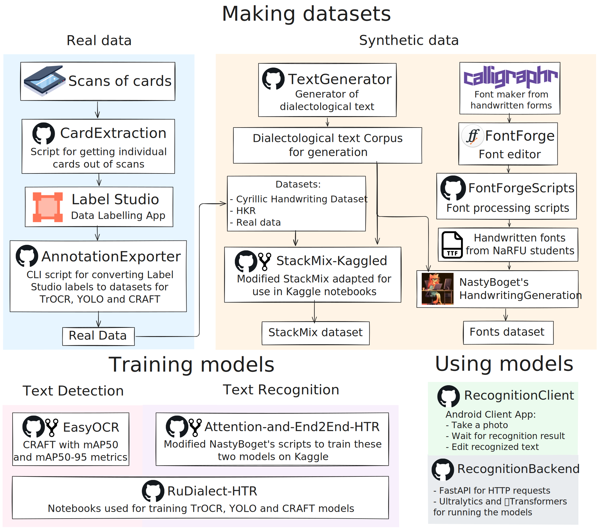

**DialecticalHTR** is an HTR solution for Russian handwriting with diacritic characters (e.g. acutes, breves).

Made as a bachelor thesis at [NaRFU](https://narfu.ru) by:

<ul>
    <li><a href="https://github.com/SaylesMand">Matvienko Daniil</a>: Machine Learning</li>
    <li><a href="https://github.com/ACherryJam">Starikov Alexander</a>: Dataset Building and implementation of client-server mobile app</li>
</ul>

The text of the bachelor thesis is available here: [Google Drive](https://drive.google.com/file/d/19tcBxANDFo55pjVcubdXDi4XHQVaXM1L/view?usp=sharing)

# Important Repositories

<table>
    <thead>
        <td>Repository</td>
        <td>Content</td>
    </thead>
    <tbody>
        <tr>
            <td><a href="https://github.com/DialecticalHTR/RuDialect-HTR">Dialect-HTR</a></td>
            <td>Notebooks used for training TrOCR, YOLO and CRAFT models</td>
        </tr>
        <tr>
            <td>RecognitionClient (not uploaded yet)</td>
            <td>Android mobile application for recognition of dialectological handwritten materials</td>
        </tr>
        <tr>
            <td>RecognitionBackend (not uploaded yet)</td>
            <td>Server that uses the trained models for HTR</td>
        </tr>
    </tbody>
</table>

# Organization Overview

